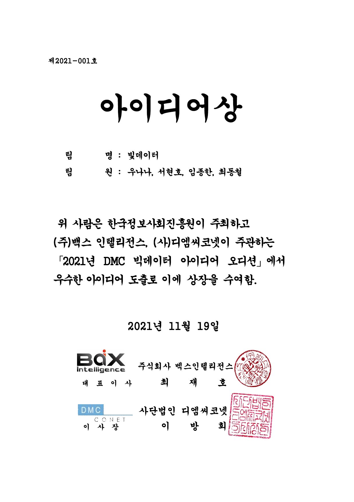
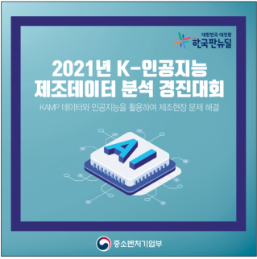
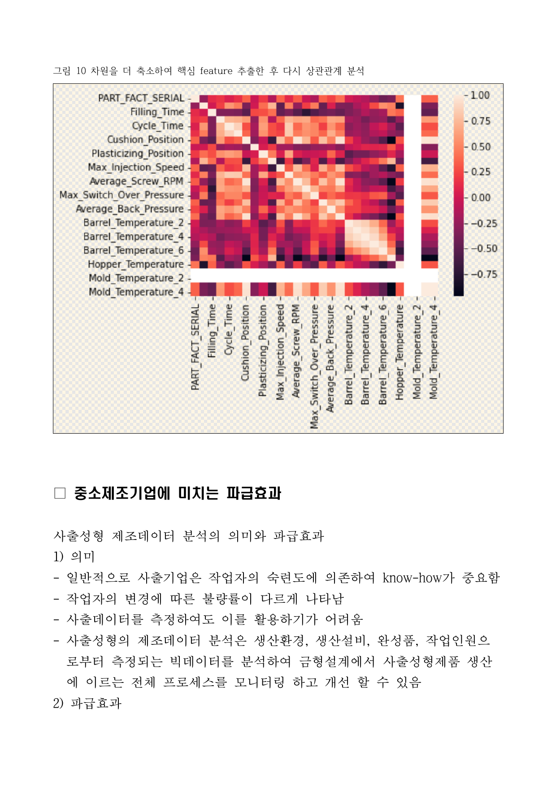

# Hackathon
## 임종한 withyou@empal.com<li>2021년 부품 품질 검사 - 부품 스크래치 검사 솔루션
<table>
<th>
<a href="./202309 Prompt-er Day in Seoul">
</th>
<th>
<a href="./202309 Prompt-er Day in Seoul">
</th>
</table>
<li>2021년 부품 품질 검사 - 부품 스크래치 검사 솔루션
<table>
<th>
<a href="./202112 부품 품질 검사 영상 인공지능 학습데이터 해커톤_3등 우수상">
</th>
<th>
<a href="./202112 부품 품질 검사 영상 인공지능 학습데이터 해커톤_3등 우수상">
</th>
</table>
<li>2021년 마곡 해커톤
<table>
<th>
<a href="./202110~202112_ROS_2등 우수상">
</th>
<th>
<a href="./202110~202112_ROS_2등 우수상">
</th>
</table>
<li>2021년 DMC 빅데이터 아이디어 오디션
<table>
<th>

</th>
<th>

</th>
</table>
<li>2021년 KAMP 스마트 팩토리 제조 혁신 해커톤
<table>
<th>
<a href="./202111~20211203_KAMP">
</th>
<th>
<a href="./202111~20211203_KAMP">
</th>
</table>
<li>2021년 의료 해커톤 심장 움직임 인식
<table>
<th>
<a href="./202112 heart_datathon_heart_AC2_AC$_JI">
</th>
<th>

<a href="./202112 heart_datathon_heart_AC2_AC$_JI">

<a href="./202112 heart_datathon_heart_AC2_AC$_JI">
</th>
</table>

